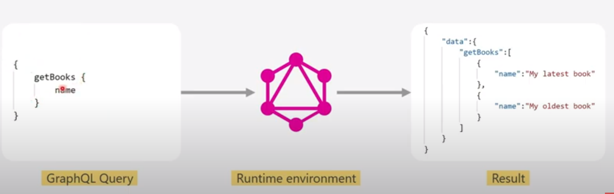
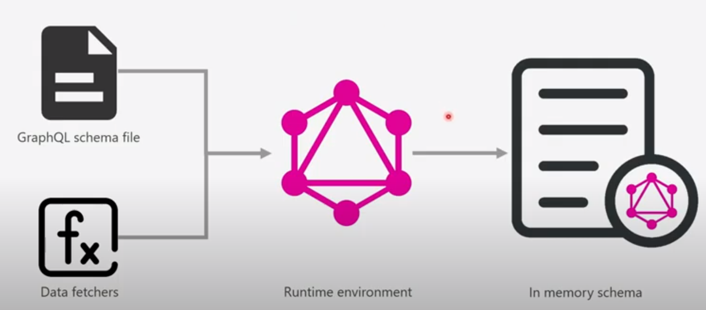
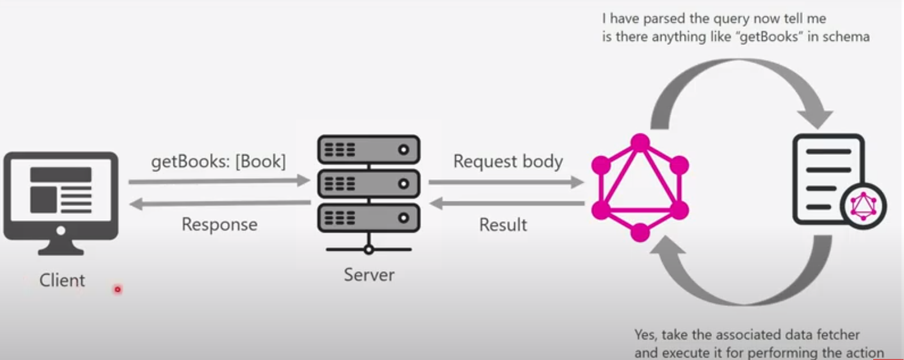
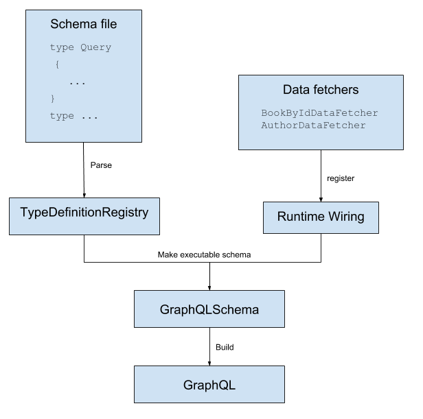

= GraphQL

*Introduction*

GraphQL is a query language for your API, and a server-side runtime for executing queries by using a type system you define for your data. GraphQL isn't tied to any specific database or storage engine and is instead backed by your existing code and data.

*Why GraphQL?*

* Versioning: To avoid multiple versioning of your rest API.
* Ask for what you need: Client has a provision to ask only those fields which they needs. There would be no handling on server side specific to the platform.
* Get many API’s response in single request: Client has to call one query to get data from multiple rest API’s.

*What is GraphQL?*

GraphQL is a query language for APIs and a runtime for fulfilling those queries with your existing data. GraphQL provides a complete and understandable description of the data in your API, gives clients the power to ask for exactly what they need and nothing more, makes it easier to evolve APIs over time, and enables powerful developer tools.

Important points

 * GraphQL is a query language for APIs not tool for building the APIs
 *  A client get exactly what it want from an API nothing more than that.

GraphQL is collection of 3 things

* Schema definition language or SDL
* Runtime environment
* Query Language

*Schema definition language or SDL*

* SDL is used to define the GraphQL schema.
* A GraphQL schema is expose the functionality that are available in application to the user.
* A GraphQL schema contains:
  ** Types which are similar to Java class.
  ** Operations which can be performed on these Types, similar to methods in java.

```
//Query is for read opertions
type Query {
    getBook(Int:id):Book
    getBooks:[Book]
}

//Mutation is for manipulate opertaions
type Mutation {
   createBook(name:String, page:Int):Int
}

//Book type as like class in Java
type Book {
 id:Int
 name:String
 page:Int
}
```

*Runtime Environment*

Runtime Environment performs two major opertaions:

* Parsing Schema File:
 Parsing Schema file and creating in-memory schema from it, reading the information from the schema file again and again will be inefficient , so runtime env creates in-memory representation of the schema file.

* Executing the Operations: A user can request any of the operations which are defined in the schema file, Runtime environment is responsible for handling the user request it looks the operation specified in request then it uses the
in-memory schema, if operations exist then runtime will execute it and perform the specified actions like reading or manipulating the data to the server.

*Query Language*

* QL is used by client to use the operations that are defined in schema file
* QL Enables a client to select only the required fields form set of fieldshttps://xxx[]




*Data Fetcher*

* Data Fetcher is callback function
* It is linked to every query , mutation and field.
* When client uses operations defined in schema file the Runtime environment invokes the Data Fetcher linked to operation in order to perform specified operations.

```
    // getBook:[Book]
    public DataFetcher<Book> getBook() {
		return env -> bookRepository.findById(env.getArgument("id")).map(Function.identity()).orElse(null));
	}

   // createBook(name:String, page:Int):Int
	public DataFetcher<Book> createBook() {
		return env -> bookRepository.save(objectMapper.reader().readValue(objectMapper.writeValueAsString(env.getArgument("book")), BookEntity.class));
	}
```

*Preparing Inmemory execution*



*Executing the opertaions*



*How GraphQL works in Java?*




*Reference Link*

* GraphQL Introduction https://graphql.org/
* GraphQL FAQ https://graphql.org/faq/
* GraphQL Java https://www.graphql-java.com/documentation/v16/

