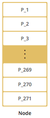
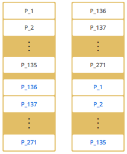

= Hazelcast

Before Understanding the Hazelcast lets understand some of the below topics.

*What is Cache?*

In Computing industry , a cache is a hardware or software component that stores the data for server so that future data request can be  faster.

*Why Cache is needed ?*

We know that cache used by CPU/hardware that helps to process faster. What if this concept can be taken to the application/software level. This is where Caching helps.

There are many types of the Cache like local cache ie means only to the localof your application for eg HashMap just hold that data for that class or method its local to the class .what if you want to access all over other nodes. then comes distributed cache.

*What Is a Distributed Cache ?*

A distributed cache is a system that pools together the random-access memory (RAM) of multiple networked computers into a single in-memory data store used as a data cache to provide fast access to data

image::Distributed-Cache.png[]

*What are the Distributed Cache Softwares?*

There are many tools or software for Distributed Cache , in that Redis and Hazelcast is most widely used Distributed.

*Why Hazelcast ?*

Hazelcast provides the leading in-memory computing platform for high-performance data processing at scale, accelerating applications for the most innovative global brands

https://hazelcast.com/why-hazelcast/[]

Compare Redis and Hazelcast

|===
|Redis |Hazelcast

|Caching: Redis Uses only on pattern for caching(cache-aside pattern)
|Caching: Hazelcast Uses number of patterns (read-through, write-through, and write-behind)

|Clustering: Redis requires manual intervention
|Clustering: Most clustering operations are handled automatically by Hazelcast

|Querying: Redis does not understands complex object graphs and provides querying API.
|Querying:Hazelcast understands complex object graphs and provides querying API.

|Streaming: Redis supports  pub-sub messaging to distribute streaming data
|Streaming: Hazelcast comes with a full streaming stack(Messaging ,processing ,connectors)

|Compute : Redis supports Lua Scripts
|Compute : Hazelcast allows Java and soon Python & C++

|===

More reference can found here.
https://hazelcast.org/compare-with-redis/#:~:text=The%20biggest%20difference%20between%20Hazelcast,this%20introduces%20extra%20network%20hops[]

*What is Hazelcast ?*

In computing, Hazelcast IMDG is an open source in-memory data grid based on Java. It is also the name of the company developing the product, Hazelcast provides central, predictable scaling of applications through in-memory access to frequently used data and across an elastically scalable data grid.

*Use Case for Hazelcast?*

Typical use-cases for Hazelcast include:

* Application scaling
* Cache-as-a-service
* Cross-JVM communication and shared storage
* Distributed cache, often in front of a database
* In-memory processing and Analytics
* In-memory computing
* Internet of Things infrastructure
* Key-value database
* Memcached alternative with a protocol compatible interface[5]
* Microservices infrastructure
* NoSQL data store
* Spring Cache
* Web Session clustering

*Hazelcast Architecture*

[TIP]
You can see small "HD" boxes for some features in the above diagram. Those features can use High-Density (HD) Memory Store when it is available. It means if you have Hazelcast IMDG Enterprise HD, you can use those features with HD Memory Store.

* Hazelcast is an inMemory Data Grid
* Hazelcast is an extension of ConcurrentHashMap, here Object shared between multiple jvms.
* Discovery Mechanism being use to connect JVM's (Node)
* Data stored in-memory(RAM) of the server, since its incredibly fast.
* Multiple copies are stored in multiple machines for automatic data recovery in case of fauilure.

*Data Partitioning*

* Why? Hazelcast stores data in partition, Fast Data operation across cluster.
* By default, Hazelcast creates a single copy/replica of each partition.
* You can configure Hazelcast so that each partition can have multiple replicas. One of these replicas is called "primary" and others are called "backups
* The cluster member which owns the "primary" replica of a partition is called the "partition owner". When you read or write a particular data entry, you transparently talk to the partition owner that contains the data entry
* By default, Hazelcast offers 271 partitions. When you start a cluster with a single member, it owns all of 271 partitions (i.e., it keeps primary replicas for 271 partitions). The following illustration shows the partitions in a Hazelcast cluster with single member.

* When you start a second member on that cluster (creating a Hazelcast cluster with two members), the partition replicas are distributed as shown in the illustration here.

* In the illustration, the partition replicas with black text are primaries and the partition replicas with blue text are backups
* The first member has primary replicas of 135 partitions (black) and each of these partitions are backed up in the second member (i.e., the second member owns the backup replicas) (blue)
* same time, the first member also has the backup replicas of the second member’s primary partition replicas.

*How Data is Partitioned*

Hazelcast distributes data entries into the partitions using a hashing algorithm.

* the key or name is serialized (converted into a byte array)
* this byte array is hashed
* the result of the hash is mod by the number of partitions.
* The result of this modulo - MOD(hash result, partition count) - is the partition in which the data will be stored,that is the partition ID.
*  For ALL members you have in your cluster, the partition ID for a given key is always the same.

*Partition Table*

* When you start a member, a partition table is created within it. This table stores the partition IDs and the cluster members to which they belong.
* The purpose of this table is to make all members (including lite members) in the cluster aware of this information, making sure that each member knows where the data is.
* The oldest member in the cluster (the one that started first) periodically sends the partition table to all members
* The ownerships may be changed when, for example, a new member joins the cluster, or when a member leaves the cluster
* You can configure the frequency (how often) that the member sends the partition table the information by using the hazelcast.partition.table.send.interval(default 15sec) system property

*Repartitioning*

* Repartitioning is the process of redistribution of partition ownerships
* Hazelcast performs the repartitioning when a member joins or leaves the cluster.
* In these cases, the partition table in the oldest member is updated with the new partition ownerships
* Note that if a lite member joins or leaves a cluster, repartitioning is not triggered since lite members do not own any partitions

*Cache Access Patterns*

Read-Through Cache

* In a read-through pattern, applications request data directly from the caching system, and if the data exists in the cache, that data is returned to the application. If the data does not exist, then the system retrieves the data from the underlying backend store. The system then loads that data into the cache and returns the data to the backend store.

* Hazelcast IMDG handles the entire process so the application does not need to coordinate reads from the underlying store upon cache misses. To establish the link between IMDG and the backend store, application developers write pluggable query code that is executed by Hazelcast in the event of a cache miss.

*Write-Through Cache*

* In a write-through pattern, applications can directly update data in the cache, and whenever that is done, the updated data is synchronously and automatically persisted to the backend data store.
* This pattern is about ensuring the cache and backend store are synchronized and is not intended to address performance, since the backend store is still the bottleneck in an update process.

image::Write-Through.png[]

*Write-Behind Cache*

* In a write-behind pattern, applications can update data in the cache similarly to the write-through cache pattern, except the automatic updates to the backend store are asynchronous. This means this pattern offers a performance advantage since updates to the data do not have to wait for writes to the backend store. Updates to data in the cache are acknowledged quickly since only in-memory data is updated, and Hazelcast IMDG will later push the data updates to the backend store.
* To improve performance, write-behind caching uses a technique known as conflation, in which changes to the cache are consolidated in order to limit the number of transactions needed to update the database. For example, if a value is changed from 1 to 2 in the cache, and then later from 2 to 3, the database will only be updated to change the value from 1 to 3.
* As long as the time limit is not too long, write-behind caching may still deliver acceptable protection from system failures. However, the risk of data loss is greater when using write-behind caching. If the system goes down, any changes to the cache data may not have yet been sent to the database.

*Near Cache*

* It is highly recommended for data structures that are mostly read. When an object is fetched from a remote Hazelcast member, it is inserted into the local cache, so subsequent requests are handled by a local member retrieving from the local cache. If Hazelcast near cache features in client-server deployments are being used, microsecond response times can be achieved with the right serialization.

Caching Architectural Patterns

*Embedded Cache*

The simplest possible caching pattern is Embedded Cache.

* Request comes in to the Load Balancer
* Load Balancer forwards the request to one of the Application services
* Application receives the request and checks if the same request was already executed (and stored in cache)
* If yes, then return the cached value
* If not, then perform the long-lasting business operation, store the result in the cache, and return the result

*Embedded Distributed Cache*

* It's still the same pattern as Embedded Cache; however, this time we’ll use Hazelcast instead of the default non-distributed cache library.

*Client-Server Cache*

*  Request comes into the Load Balancer and is forwarded to one of the Application services
* Application uses cache client to connect to Cache Server
* If there is no value found, then perform the usual business logic, cache the value, and return the response

*Sidecar Cache*

* The Kubernetes-specific, because the Sidecar pattern is mostly seen in (but not limited to) Kubernetes environments. In Kubernetes, a deployment unit is called a POD. This POD contains one or more containers which are always deployed on the same physical machine. Usually, a POD contains only one container with the application itself. However, in some cases, you can include not only the application container but some additional containers which provide additional functionalities. These containers are called sidecar containers.

This time, the flow looks as follows:

* Request comes to the Kubernetes Service (Load Balancer) and is forwarded to one of the PODs
* Request comes to the Application Container and Application uses the cache client to connect to the Cache Container (technically Cache Server is always available at localhost)

This solution is a mixture of the Embedded and Client-Server patterns. It’s similar to Embedded Cache, because:

* Cache is always at the same machine as the application (low latency)
* Resource pool and management activities are shared between cache and application
* Cache cluster discovery is not an issue (it’s always available at localhost)

It’s also similar to the Client-Server pattern, because:

* Application can be written in any programming language (it uses the cache client library for communication)
* There is some isolation of cache and application

